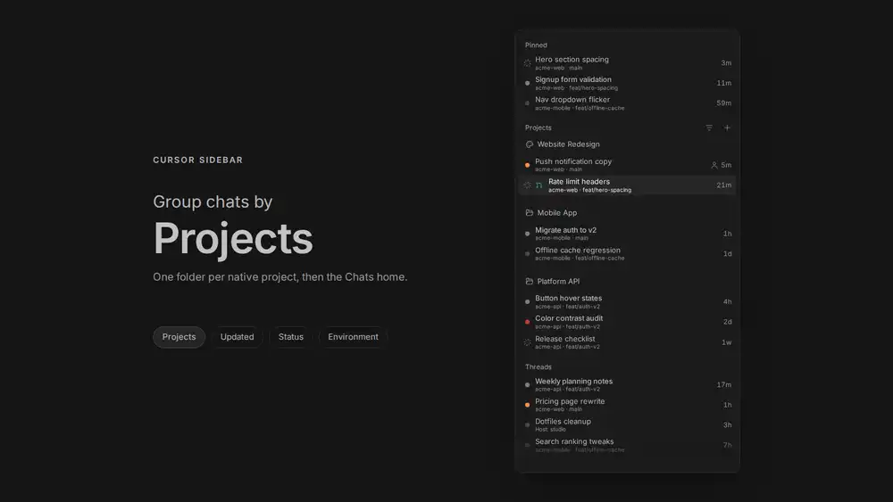

# Cursor Sidebar

A port of Cursor's sidebar to BB, with four view modes: group chats by project,
status, environment or date.

Chats nest under the chat that spawned them, pinned chats gather in one block,
and standalone chats file into folders. The view settings live in the plugin's
own database on the BB server, so uninstalling the plugin removes them and
leaves your threads alone.

## Grouping



Sample chats, grouped four ways. The [mp4 is here](docs/media/grouping-demo.mp4)
if your browser will not play the WebP.

## The view menu

| Control | What it changes |
| --- | --- |
| **Grouping** | Projects, Updated, Status or Environment. One at a time, never stacked |
| **Chat order** | By last activity, or by status |
| **Project order** | By hand, or by worst status and then by the project used most recently. Projects grouping only |
| **Group order** | Most recent first, or the grouping's own default order |
| **Show** | Updated time, environment, branch, machine and the pull request mark |
| **Status filter** | Needs your input, Failed, Working, Unread, Idle |
| **Environment filter** | Which environments appear, including chats with none |
| **Expand All / Collapse All** | Every section and group at once |
| **Mark All as Read** | Every loaded chat that is unread |

The three order controls live under Ordering and the two filters live under
Filters.

Updated groups and age labels use conversation activity rather than unrelated
thread metadata changes. The selected conversation stays visible when a group
has more than one page of rows.

The menu button shows a warning mark when a view change has not reached the
server. The notice inside the menu has a Retry button.

## Mobile

Touch uses the same list. A phone has no hover, so gestures carry the actions
instead.

| | Do this |
| --- | --- |
| Open a chat | Tap the row |
| Fold a project | Tap its name |
| Pin a chat | Swipe the row left |
| Archive a chat | Swipe the row right |
| Move a chat or a project | Hold until the row lifts, then drag |
| Open the actions menu | Hold until the row lifts, then let go without moving |
| Reorder a project without dragging | Hold the heading, then pick Move up or Move down. Project order Manual only |

A swipe has to travel 72px to commit. Anything shorter eases the row back.

While a row is lifted, or a swipe is locked sideways, the plugin holds the list
still so the gesture wins over the scroll. A plain vertical drag still scrolls
the list.

Letting go of a lifted row without moving opens its menu, and that menu holds
Expand children or Collapse children for a chat that has any. A lifted drag
drops where you leave it: a folder heading files the chat, the middle of another
chat in the same project nests it, and a project heading between two others
reorders the projects.

The pin and archive icons stay hidden on touch. Nothing reveals them without
hover, and the 44px targets a phone needs do not fit in a row, so a swipe or
the actions menu does that work instead.

## Requirements

BB with Plugin SDK 0.5.9 or newer. The plugin fills BB's experimental thread-list slot, which
replaces BB's own thread list. Turn it off with `bb plugin disable cursor-sidebar`.

## Install

```sh
    bb plugin install git:https://github.com/mauforonda/bb-plugin-cursor-sidebar.git
bb plugin reload cursor-sidebar
```

## Development

```sh
npm run typecheck          # tsc --noEmit
npm run build              # bb plugin build writes dist/
bb plugin reload cursor-sidebar
```

The realtime channel names shared with the backend live in `src/channels.ts`.
Frontend modules must import them from there, and may only `import type` from
`src/server.ts`. The backend imports `@get-bb/plugin-sdk`, which is a dev
dependency: a git install prunes dev dependencies and the host only hands the
SDK to the server bundle, so a value import of `./server` from frontend code
drags the backend into `app.js` and fails `bb plugin install git:...` with
`Could not resolve "@get-bb/plugin-sdk"` — while still building on a machine
that has the SDK installed.

## License

MIT. Portions adapted from bb-plugin-thread-inbox. See
[THIRD-PARTY-NOTICES.md](THIRD-PARTY-NOTICES.md).
