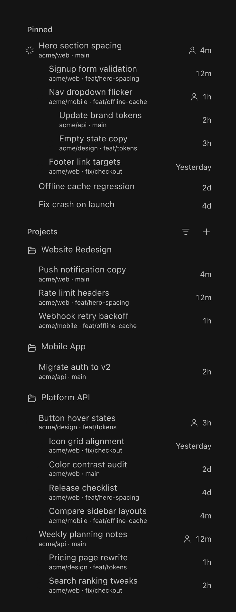
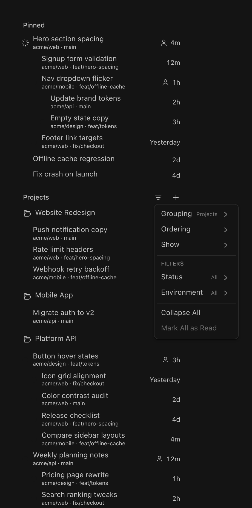

# Cursor Sidebar

A thread list for BB that files every chat under the project it belongs to.

BB ships a flat, recency-ordered list. Cursor Sidebar replaces it with a tree:
your native Projects become foldable folders, chats spawned from a chat nest
underneath it with connecting rails, pinned chats gather in one place, and each
row tells you at a glance whether work is running, finished unread, or needs
you.



*Screenshot uses example data.*

## What you get

**Projects, in BB's own order.** Every native project gets a folder heading,
including empty ones. Click the heading to fold it. A picked icon replaces the
folder; `Set icon…` lives on the heading's right-click menu.

**Real ancestry.** A spawned or forked thread hangs under the thread that made
it, drawn with faint rail and elbow connectors. Nothing is invented: the
project id and the parent link come from the native thread.

**Activity you can read from the top.** A working thread spins. A finished but
unread thread shows a dot; a failed one or one waiting on you shows its mark.
A closed project keeps a small badge on its folder glyph, so a collapsed
project still tells you something inside it is moving. Reduced motion stops the
spin.

**One Pinned block.** Pinned chats are lifted out of their project into a
single block above Projects, so the things you keep coming back to are in one
place. Every other chat appears exactly once: in its folder, in its date group,
or in Pinned.

**Folders for standalone chats.** Standalone chats can be filed into BB's
native named thread sections, which render as folders with Rename and Delete on
their heading. Filing never archives, deletes, or changes which project a chat
belongs to.

**A view you control.** Grouping, ordering, filters and metadata live in one
menu, and the choices are remembered per user and synced across your clients.

## The view menu



| Control | What it changes |
| --- | --- |
| **Grouping** | Projects (one folder per project), Updated / Status / Environment (one pooled list grouped by date, status or environment) |
| **Ordering** | Chats by last activity or status; Projects by hand or by worst status |
| **Show** | Environment, branch, host and pull-request metadata on each row |
| **Filters → Status** | Which statuses appear (needs input, failed, working, unread, idle) |
| **Filters → Environment** | Which environments appear |
| **Expand All / Collapse All** | Every section and group at once |
| **Mark All as Read** | The loaded chats |

## Controls

| | Do this |
| --- | --- |
| Open a chat | Click the row |
| Rename | Double-click the title |
| Row actions | Right-click, `Shift+F10`, hold on touch, or the hover Actions control |
| Fold a project | Click the heading |
| File or pin a family | Drag it onto a folder heading or onto Pinned; drag it onto a date heading to unfile |
| Reorder projects | Drag a heading, or `Alt+ArrowUp/Down`, while Projects ordering is Manual |
| Jump to a chat | Hold `Ctrl`/`⌘` for the numbered guide, then press `1`–`9` |
| Phone | Hold to fold or open actions; swipe left to archive, right to pin |

Dragging a chat nests it (drop on another chat in the same project), files it
(folder heading), pins it (Pinned heading), or unfiles it (date heading). A
family moves as one: the root carries its replies. Threads always auto-sort, so
dragging never leaves a manual sibling order.

## How it works

Cursor Sidebar reads BB's live sidebar feed. Project identity, thread ids and
parent links stay authoritative; the plugin never creates Cores, workers or
managed membership, and it never moves a chat between projects (the SDK cannot
change native project membership).

What the plugin does store, in its own SQLite database on the BB server:

- the shared **view** (grouping, ordering, filters, Show) — per user, so every
  client sees the same sidebar;
- the **project order** overlay, used only while Projects ordering is Manual;
- **project icons**, an overlay keyed by the native project id.

Folds are remembered per client. Pins, folders and read state are BB's own
thread state. Uninstalling the plugin removes its overlays and leaves threads
untouched.

## Development

```sh
npm run typecheck          # tsc --noEmit
npm run build              # bb plugin build → dist/
bb plugin reload cursor-sidebar
```

The backend is `src/server.ts` (RPC contract, migrations, realtime channels);
the app is `app.tsx` → `src/CursorSidebar.tsx`. Migrations are append-only:
BB's runner matches recorded statements by index, so a new table only ever goes
at the end.

## License

MIT. Portions adapted from **bb-plugin-thread-inbox**; see
[THIRD-PARTY-NOTICES.md](THIRD-PARTY-NOTICES.md).
